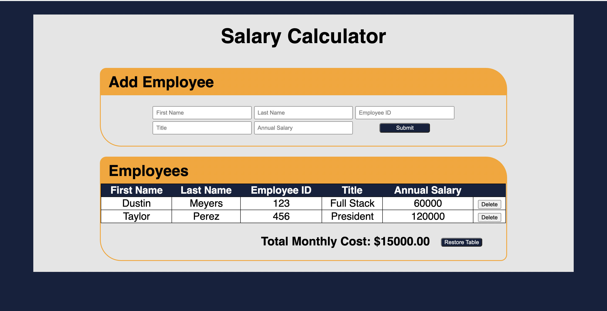
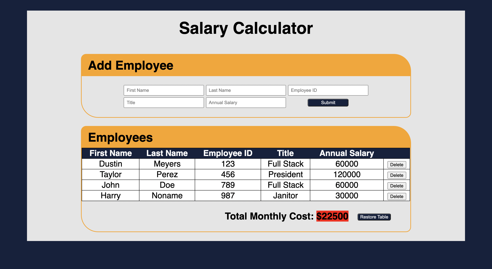

# Dusty's Salary Calculator

[Project Instructions](./INSTRUCTIONS.md), this line may be removed once you have updated the README.md

## Description

Duration: Weekend Sprint

This app allows one to input data about one's employees. This includes the employee's first name, last name, employee ID number, job title, and annual salary. That information is then stored in an array and displayed on the webpage in the form of a table. As one inputs each employee's information, the app automatically calculates what that would evaluate to in monthly cost. It then renders that on the display. If the total monthly cost of all of the employees exceeds $20,000, the total monthly cost will highlight in red as a warning. Each row generated, also generates a delete button at the end of the row. One can use that to remove that employee's information from the display, which in turn will recalculate and render the total monthly cost. There is a restore button located next to the monthly cost that will render the table with all of the stored employee data after one has deleted any number of rows.

## Screen Shot

## Usage

1. The client wants to see what employee or accumulation of employees forces their monthly budget to exceed $20,000.
2. They input each of their employees' data into the form, one-by-one.
3. As each employee is submitted to the form, that same data is then rendered in the table below the form.
4. Each employee will be rendered in a row that has a "Delete" button at the end.
5. The monthly cost is displayed below the table.
6. If the monthly cost is larger than 20,000 the background color of the total will change to red.
7. The client can remove employees from the table with the "Delete" button in its respective row.
8. When an employee is removed, the total monthly cost is adjust below the table.
9. If the client wants to show all of the employees again after they have been removed from the table, the client can use the restore button to restore it to a full table.

## Built With

This project is built with HTML, CSS, Javascript and jQuery.

## Acknowledgement

Thanks to Prime Digital Academy who equipped and helped me to make this application a reality.

## TODO

### Input Form

- [x] Input Employee Data
  - [x] First Name
  - [x] Last Name
  - [x] ID
  - [x] Title
  - [x] Annual Salary
- [x] Submit Button
  - [x] Takes in the data for storage
  - [x] Clear input fields on click

### Output to Table

- [x] Display Table
- [x] Table has Header with pertinent information
  - [x] First Name
  - [x] Last Name
  - [x] ID
  - [x] Title
  - [x] Annual Salary
  - [x] Additional column for delete button
- [x] Display each employee after input
  - [x] Delete button appears next to each employee in column
  - [x] Delete button works
- [x] Display Total Monthly Cost

  - [x] Take in all the annual salaries and add them up
  - [x] Divide them by 12 (monthly)
  - [x] Update DOM to

  ### Stretch Goals

  - [x] Styles
  - [x] Restore button
  - [x] Calculate Monthly Cost when deleted
